<div align="center">

# 🔮 ARCANE

### Autonomous Repair & Conflict-Aware Node Engine

[](https://python.org)
[](https://langchain-ai.github.io/langgraph/)
[](https://ai.google.dev)
[](https://react.dev)
[](https://fastapi.tiangolo.com)

**9 AI agents. One state machine. Zero human intervention.**

*From CI failure to a validated, documented Pull Request — in under 30 seconds.*

---

**Team Bahadur** · Rishi · Aryan · Ajinkya · Ajaya

</div>

---

## 📖 What is ARCANE?

ARCANE is a **fully autonomous CI/CD failure repair system** that watches your GitHub repository in real-time. When a test fails, ARCANE:

1. 🔍 **Detects** the failure via GitHub webhook
2. 🧬 **Bisects** the commit history to find the exact breaking commit
3. 🧠 **Generates** an intelligent code patch using LLM inference
4. 🔄 **Propagates** the fix across dependent files using AST analysis
5. ⚔️ **Resolves** merge conflicts using semantic intent inference
6. 🐳 **Validates** the patch inside an isolated Docker sandbox
7. 🧪 **Writes** a regression test to prevent the bug from returning
8. 📝 **Opens** a Pull Request with a Mermaid execution diagram

All of this happens **autonomously** — no human in the loop.

---

## 🏛️ Architecture

```mermaid
flowchart LR
    A[GitHub Push] --> B[Webhook Receiver]
    B --> C[LangGraph Orchestrator]
    C --> D[Analyst Agent]
    D --> E[Git Bisect Agent]
    E --> F[Patch Generator]
    F --> G[Cross-File Propagator]
    G --> H[Conflict Resolver]
    H --> I[Validator Agent]
    I --> J[Regression Test Gen]
    J --> K[PR Agent]
    K --> L[GitHub Pull Request]
```



### LLM Fallback Chain

ARCANE features a **4-tier resilient LLM fallback chain** ensuring the pipeline never fails due to API limits:

| Tier | Model | Trigger |
|------|-------|---------|
| 1 | Gemini 2.5 Flash | Primary — best quality |
| 2 | Gemma 3 27B | On Flash 429 — same API key, separate quota |
| 3 | Ollama llama3:8b | On Gemma 429 — local, no API needed |
| 4 | Static offline mock | If everything is down — demo always succeeds |

---

## 🧠 The 9-Agent Arsenal

| # | Agent | File | Role |
|---|-------|------|------|
| 1 | **Analyst Agent** | `agents/analyst_agent.py` | Parses CI logs → extracts failing test, file, root cause |
| 2 | **Git Bisect Agent** | `agents/git_bisect_agent.py` | Replays history inside Docker to find the breaking commit |
| 3 | **Patch Generator** | `agents/patch_generator.py` | LLM-driven unified diff generation |
| 4 | **Cross-File Propagator** | `agents/cross_file_propagator.py` | AST dependency graph → patches all affected files |
| 5 | **Conflict Resolver** | `agents/conflict_resolver.py` | Semantic intent inference + confidence-gated auto-resolve |
| 6 | **Validator Agent** | `agents/validator_agent.py` | Docker sandbox → `pytest` execution → cascade detection |
| 7 | **Regression Test Gen** | `agents/regression_test_generator.py` | Synthesizes a `pytest` function to trap the root cause |
| 8 | **PR Agent** | `agents/pr_agent.py` | 7-section PR body + Mermaid diagram + auto-approval badge |
| 9 | **ChromaDB Memory** | `agents/chroma_memory.py` | Patch pattern cache — sub-second "fast-forward" on known bugs |

---

## 🗂️ Project Structure

```
ARCANE_Nexus2.0/
├── agents/                        # All 9 AI agents
│   ├── orchestrator.py            # LangGraph state machine (FSM)
│   ├── workflow.py                # Graph definition & edge routing
│   ├── llm_client.py              # 4-tier LLM fallback chain
│   ├── analyst_agent.py           # CI log analysis
│   ├── git_bisect_agent.py        # Commit isolation via bisect
│   ├── patch_generator.py         # LLM patch synthesis
│   ├── cross_file_propagator.py   # Multi-file AST propagation
│   │   ├── dep_graph_builder.py   #   └─ Dependency graph (tree-sitter)
│   │   ├── caller_finder.py       #   └─ Caller identification
│   │   └── multi_file_patcher.py  #   └─ Unified diff generation
│   ├── conflict_resolver.py       # Semantic conflict resolution
│   │   ├── conflict_detector.py   #   └─ Marker scanning
│   │   ├── intent_inferrer.py     #   └─ LLM intent analysis
│   │   ├── confidence_scorer.py   #   └─ Score + penalty logic
│   │   └── auto_resolver.py       #   └─ 3-tier decision gate
│   ├── validator_agent.py         # Docker sandbox validation
│   ├── regression_test_generator.py # Pytest synthesis
│   ├── pr_agent.py                # GitHub PR creation
│   ├── mermaid_generator.py       # Execution flow diagram
│   ├── chroma_memory.py           # ChromaDB vector store
│   ├── ast_parser.py              # tree-sitter parsing
│   └── ast_differ.py              # AST-level diffing
├── api/
│   ├── main.py                    # FastAPI app + lifespan consumer
│   └── webhook.py                 # GitHub webhook receiver
├── frontend/
│   ├── src/
│   │   ├── App.jsx                # Landing page
│   │   └── Dashboard.jsx          # Real-time agent status dashboard
│   └── package.json
├── tests/                         # 15 test files, 35+ test cases
├── scripts/
│   └── pre_populate_memory.py     # ChromaDB demo pre-population
├── chroma_data/                   # Persisted vector embeddings
├── arcane-demo-repo/              # Target demo repository
├── requirements.txt
├── Dockerfile                     # Sandbox container definition
└── .env.example
```

---

## 🛠️ Setup & Installation

### Prerequisites
- Python 3.10+
- Node.js 18+ (for the dashboard)
- Docker Desktop (engine must be running)
- Ollama (optional — local LLM fallback)

### 1. Clone & Install

```bash
git clone https://github.com/aryanketkar-15/ARCANE_Nexus2.0.git
cd ARCANE_Nexus2.0
pip install -r requirements.txt
pip install google-genai PyGithub chromadb tree-sitter-python python-dotenv
```

### 2. Configure Environment

```bash
cp .env.example .env
```

Edit `.env` with your credentials:
```ini
GEMINI_API_KEY=your_google_api_key
GITHUB_PAT=your_github_personal_access_token
GITHUB_WEBHOOK_SECRET=your_webhook_secret
CHROMADB_PATH=./chroma_data
```

### 3. Pre-populate ChromaDB Memory

```bash
python scripts/pre_populate_memory.py
```

### 4. Start the System (3 Terminals)

**Terminal 1 — Backend:**
```bash
uvicorn api.main:app --reload
```

**Terminal 2 — Frontend Dashboard:**
```bash
cd frontend && npm install && npm run dev
```

**Terminal 3 — Webhook Tunnel:**
```bash
ssh -p 443 -R0:127.0.0.1:8000 qr@a.pinggy.io
```

> Set the Pinggy URL as the Payload URL in your GitHub repo's Webhook settings → `https://YOUR-URL/webhook`

### 5. Trigger the Pipeline

```bash
cd arcane-demo-repo
git commit --allow-empty -m "fix(auth): update token validation logic"
git push origin main
```

---

## ⚡ Pipeline Flow

```
Developer pushes code
        │
        ▼
GitHub Actions fails → Webhook fires
        │
        ▼
┌──────────────────────────────────────────┐
│  LangGraph State Machine (orchestrator)  │
│                                          │
│  ANALYZING ─► BISECTING ─► PATCHING     │
│       │                        │         │
│  [ChromaDB]              ┌────┘         │
│  memory hit?             ▼              │
│       │          PROPAGATING            │
│       ▼               │                │
│  Fast-forward     CONFLICT_CHECKING     │
│       │               │                │
│       └──────► VALIDATING ◄────────────┘│
│                    │    │                │
│              pass  │    │ fail (retry)   │
│                    ▼    └──► PATCHING    │
│            GENERATING_TEST              │
│                    │                    │
│                    ▼                    │
│             CREATING_PR                 │
│                    │                    │
│                    ▼                    │
│                  DONE                   │
└──────────────────────────────────────────┘
        │
        ▼
Pull Request on GitHub
├── Patch diff
├── Mermaid execution diagram
├── Regression test
├── Confidence score
└── Auto-approval badge
```

---

## 🔑 Key Design Decisions

| Decision | Rationale |
|----------|-----------|
| **Facade Pattern** for agents | Each agent exposes a single entry point (e.g., `ConflictResolver().check()`) for clean LangGraph integration |
| **tree-sitter** for AST parsing | Language-agnostic parsing engine supporting 40+ languages — not limited to Python |
| **ChromaDB** for patch memory | Persistent vector embeddings enable sub-second "fast-forward" on known error patterns |
| **Confidence gating** | `< 60%` → escalate, `≥ 60%` → proceed, `≥ 85%` → auto-approve — prevents bad patches from reaching GitHub |
| **4-tier LLM fallback** | Gemini → Gemma → Ollama → mock — pipeline never fails regardless of API availability |
| **Docker sandbox** | Patches are tested in complete isolation — zero risk to the actual repository |

---

## 🧪 Testing

```bash
# Run all 35+ unit tests
pytest tests/ -v

# Run the full integration pipeline test
python test_pipeline.py
```

---

## 💻 Tech Stack

| Layer | Technologies |
|-------|-------------|
| **AI / LLM** | Google Gemini 2.5 Flash, Gemma 3 27B, Ollama, LangGraph |
| **Backend** | FastAPI, Python 3.12, Uvicorn |
| **Frontend** | React, Vite, CSS |
| **AST Engine** | tree-sitter, tree-sitter-python |
| **Vector DB** | ChromaDB, SentenceTransformers |
| **Infrastructure** | Docker, pytest, Git |
| **Integrations** | PyGitHub, Mermaid.js, Pinggy |

---

## 👥 Team Bahadur

| Member | Role | Key Deliverables |
|--------|------|-----------------|
| **Rishi** | GitHub Integration Lead | Webhooks, FastAPI, PR Agent, Mermaid, React Dashboard |
| **Aryan** | AST + Memory Lead | tree-sitter, Conflict Resolver, Cross-File Propagator, ChromaDB |
| **Ajinkya** | ML + Infra Lead | LangGraph FSM, Git Bisect Agent, LLM Integration, Orchestrator |
| **Ajaya** | Sandbox + Testing Lead | Docker Sandbox, Validator Agent, Regression Test Generator |

---

<div align="center">

*ARCANE doesn't just fix bugs. It travels back in time to find them — understands the entire codebase to fix them safely — writes the test so they never return — and explains every decision it made, without waking anyone up.*

**Built in 24 hours at Hackathon 2026**

</div>
